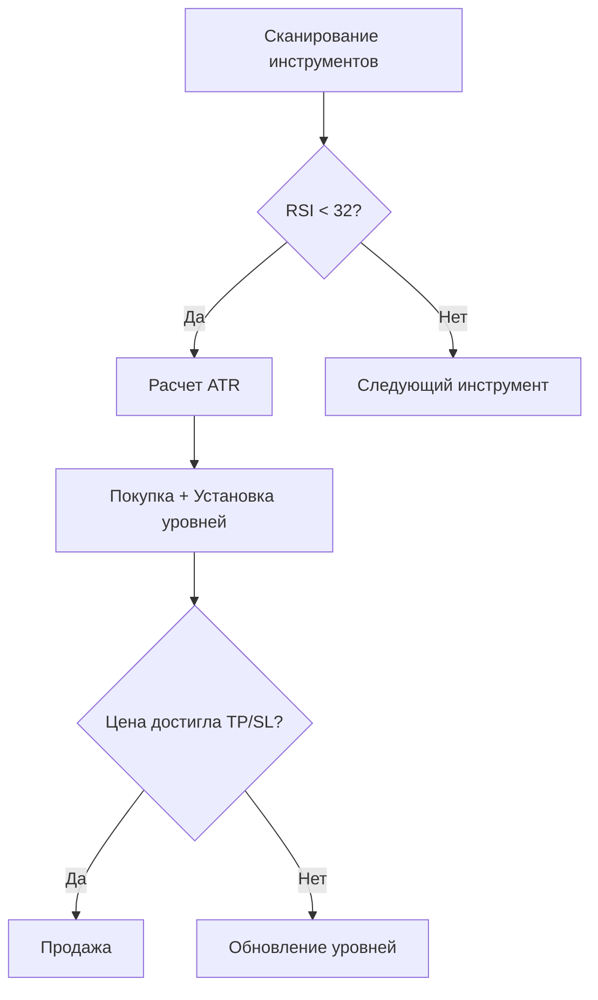

# Trader

Автоматизированная торгово-аналитическая система для работы с биржей через Tinkoff Invest API


## 📌 Основные возможности
```markdown
- **Автоматизированные сделки** на основе RSI и волатильности
- **Риск-менеджмент** с трейлинг-стопом и тейк-профитом
- Реалтайм **уведомления в Telegram** о сделках
- Поддержка до 10 одновременных позиций
- **Автоотчетность** в Excel с детализацией по периодам
- Автоматическое **выключение сервера** по расписанию
```
## ⚙️ Технологический стек

`Python 3.10+` · `Tinkoff Invest API` · `TA-Lib` · `Pandas` · `Telegram Bot API` · `Schedule`

## 🚀 Быстрый старт

### Конфигурация
1. Заполните параметры в коде:
```python
# Настройки в Трейдер.py
TINKOFF_TOKEN = 'ваш_токен_tinkoff'
ACCOUNT_ID = 'ваш_account_id'
TELEGRAM_TOKEN = 'токен_бота'
CHANNEL_ID = 'id_телеграм_канала'
```

2. Настройте торговые параметры:
```python
PURCHASE_AMOUNT = 10000  # Сумма на сделку в рублях
MAX_POSITIONS = 10        # Макс. число позиций
RSI_OVERSOLD = 32         # Уровень RSI для покупки
TAKE_PROFIT_COEF = 3      # Коэффициент тейк-профита (×ATR)
```

3. Запустите:
```bash
python Трейдер.py
```

## 📈 Стратегия торговли



## 📊 Модуль аналитики (report_generator.py)

**Назначение**: Генерация торговых отчетов с фильтрацией по периодам

**Функции**:
- Формирование отчетов за день/неделю/месяц/год
- Расчет общей прибыли за период
- Экспорт в Excel
- Валидация данных

**Использование**:
```python
from report_generator import generate_trade_report

# Отчет за неделю
generate_trade_report('week')

# Полный отчет
generate_trade_report('all')
```

**Поддерживаемые периоды**:
| Параметр     | Описание                  |
|--------------|---------------------------|
| `day`        | Текущий день              |
| `week`       | Текущая неделя            |
| `month`      | Текущий месяц             |
| `year`       | Текущий год               |
| `month_start`| С начала месяца           |
| `year_start` | С начала года             |
| `all`        | Все данные                |

## 🔐 Управление рисками

- Трейлинг-стоп через ATR (2× волатильности)
- Лимит дневных убытков (-5%)
- Автоостановка при ошибках API
- Проверка ликвидности инструмента

## 📨 Пример уведомления

```plaintext
🟢 #Акция BANE
Процент после продажи: 0.50%
Продажа по цене 2714.5
Время в сделке 2 ч 24 мин 44 сек
Не ИИР (Не индивидуальная инвестиционная рекомендация)
‼️ ОБЯЗАТЕЛЬНО К ПРОЧТЕНИЮ (https://t.me/Signali_TA/6011)
BANE
```

## ⚠️ Важные предупреждения

1. Всегда тестируйте стратегию на исторических данных
2. Настройте параметры под вашу риск-толерантность
3. Используйте песочный режим Tinkoff
4. Система не гарантирует прибыльность

## 📁 Структура проекта

```
Trader/
├── README.md             # Документация
├── Трейдер.py            # Основная логика
├── report_generator.py   # Генератор отчетов
└── trade_results.xlsx    # История сделок (автосоздается)
```

